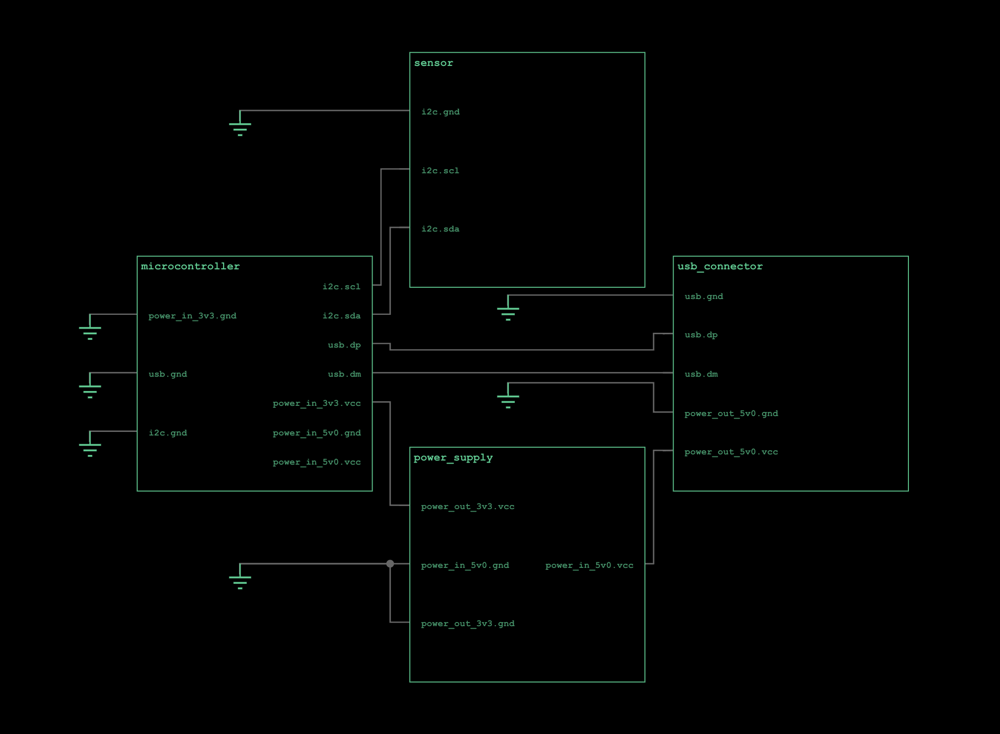

# atopile analyzer

atopile analyzer is a new language server for atopile.



## Installation

atopile analyzer is only tested on macOS, but other platforms should Just Work™.

Install via [VSCode Marketplace](https://marketplace.visualstudio.com/items?itemName=atopile.atopile), or from source:

```sh
./install.sh
```

## Supported Features

- ✅ Schematics visualizer
- ✅ Goto definition
- [ ] Auto-complete
