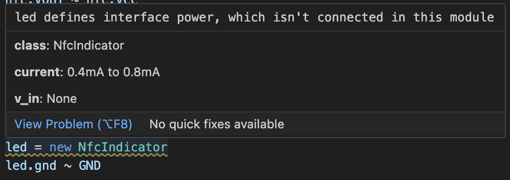

# atopile analyzer

atopile analyzer is an experimental new language server for atopile. You're
probably better off with the [official atopile
extension](https://marketplace.visualstudio.com/items?itemName=atopile.atopile).



## Installation

atopile analyzer is only tested on macOS, but other platforms should Just Work™
if you install from source:

```sh
./crates/atopile_lsp/install.sh
```

## Supported Features

- [x] Goto definition
  - We add support for a couple goto definition locations that the official LSP
    doesn't support yet.
- [x] Unused interface diagnostics
  - We try to detect when you don't use an interface that a module defines.
    Expect some false positives.
